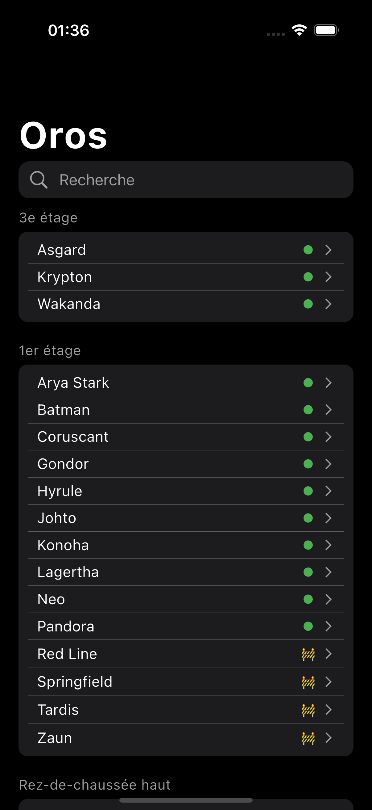
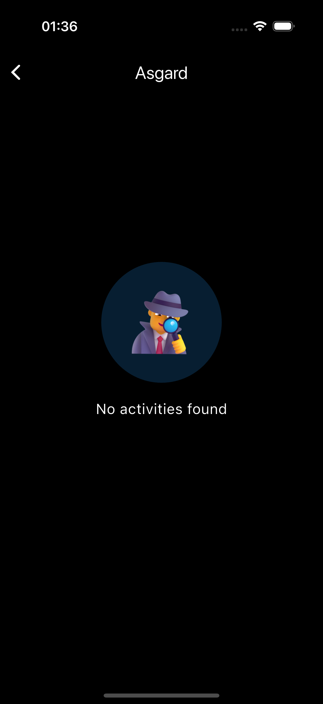

# Oros.

</img>

## Description:

The project aims to create an app that read the JSON API of oros from Nantes and display it through an ios/android app.

## Screenshots

Home Page               |  Detail Room
:-------------------------:|:-------------------------:
||

## Language & Tools used:

## Aivailable on:
iOS, Android, Web

## Usage

- install flutter engine -> https://docs.flutter.dev/get-started/install
- tap command `flutter run` in the root folder of the project

## Author

@Antoinegtir
